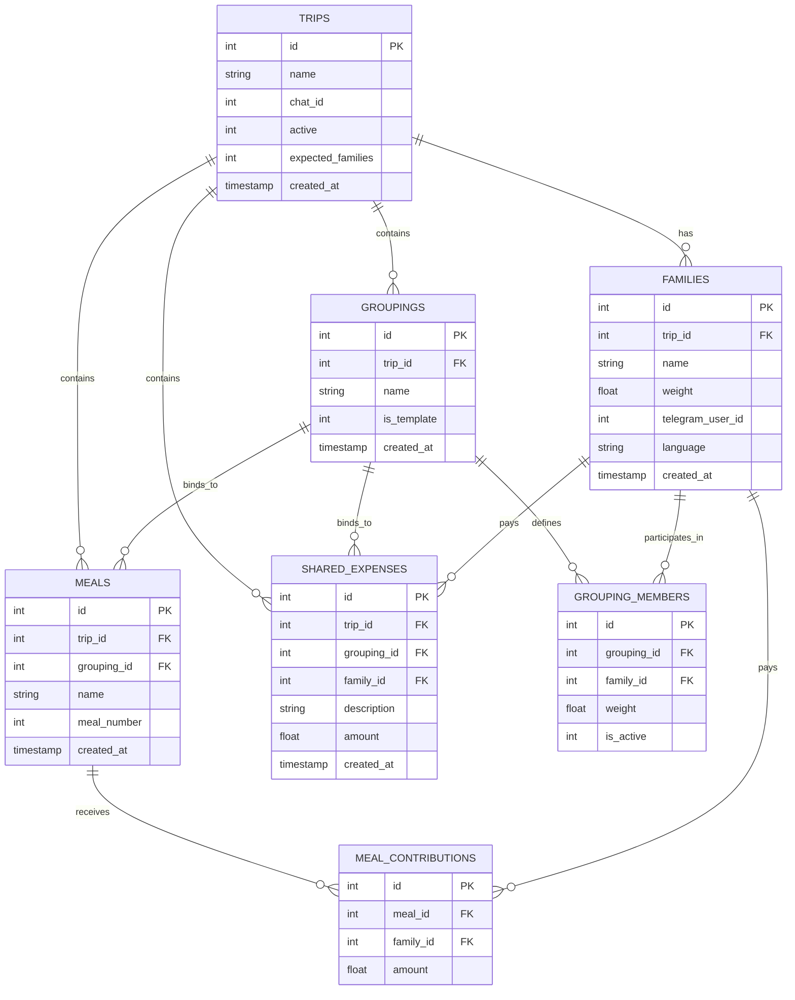
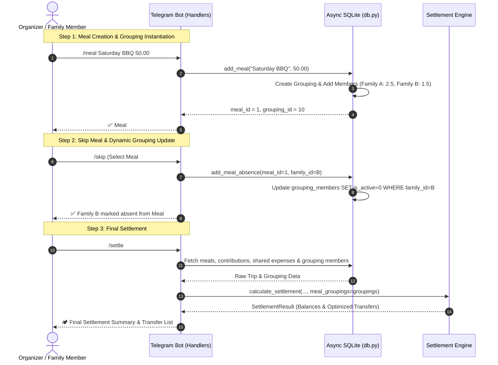

# BachzTab Architecture Documentation 🏕

This document outlines the architecture, data model, component design, and core algorithms of **BachzTab** (also known as *ShareIt*), a Telegram bot built for group trip expense splitting.

---

## 1. System Overview & Technology Stack

BachzTab simplifies group financial tracking during multi-family trips (e.g., camping). It operates inside a Telegram group chat, allowing participants to register family share weights, record shared meals and expenses, manage attendance via dynamic **Groups of Associations**, and calculate an optimized set of minimum money transfers.

```
┌─────────────────────────────────────────────────────────┐
│                    Telegram Cloud                       │
└───────────────────────────┬─────────────────────────────┘
                            │ Long Polling (HTTPS)
┌───────────────────────────▼─────────────────────────────┐
│                    BachzTab Bot Server                  │
│                                                         │
│  ┌──────────────────┐  ┌─────────────────────────────┐  │
│  │ python-telegram- │  │      Job Queue (APScheduler)│  │
│  │      bot v20+    │  │    (Daily Reminders @ 18:00)│  │
│  └────────┬─────────┘  └──────────────┬──────────────┘  │
│           │                           │                 │
│  ┌────────▼───────────────────────────▼──────────────┐  │
│  │                Command Handlers                   │  │
│  └────────────────────────┬──────────────────────────┘  │
│                           │                             │
│  ┌────────────────────────▼──────────────────────────┐  │
│  │         Groupings & Settlement Subsystems         │  │
│  └────────────────────────┬──────────────────────────┘  │
│                           │                             │
│  ┌────────────────────────▼──────────────────────────┐  │
│  │             Async SQLite Layer (aiosqlite)         │  │
│  └────────────────────────┬──────────────────────────┘  │
└───────────────────────────┼─────────────────────────────┘
                            │ Local File I/O
┌───────────────────────────▼─────────────────────────────┐
│                    SQLite Database File                 │
│                       (bachztab.db)                     │
└─────────────────────────────────────────────────────────┘
```

### Technology Stack
- **Language:** Python 3.11+
- **Bot Framework:** [`python-telegram-bot v20+`](https://github.com/python-telegram-bot/python-telegram-bot) (Fully asynchronous `asyncio` architecture)
- **Database:** SQLite via [`aiosqlite`](https://github.com/omnilib/aiosqlite) (Asynchronous non-blocking file-based relational database)
- **Timezone Management:** `zoneinfo` (Python standard library) / UTC-7 America/Vancouver timezone
- **Deployment:** Systemd service unit (`shareit.service`), daemonized on Linux VPS

---

## 2. Directory Structure

```
shareit/
├── bot/
│   ├── __init__.py          # Package initialization & version info
│   ├── main.py              # Application entry point, bot setup & job scheduling
│   ├── db.py                # Database schema, migrations & CRUD operations for Groupings
│   ├── settlement.py        # Proportional grouping calculation & greedy transfer optimization
│   ├── reminder.py          # Daily scheduled reminder & auto-cleanup jobs
│   ├── i18n.py              # Bilingual (EN/FA) dictionary-based translation engine
│   └── handlers/
│       ├── __init__.py      # Command & callback handler registration
│       ├── _helpers.py      # Common helper functions (active trip validation, error replies)
│       ├── menu.py          # Interactive main dashboard (/menu, /start) and action buttons
│       ├── trip.py          # /newtrip, /endtrip, /status
│       ├── family.py        # /join command and weight selection inline keyboards
│       ├── meal.py          # /meal, /contribute, /skip, presets and active grouping callbacks
│       ├── expense.py       # /expense command handler with category & amount presets
│       ├── settle.py        # /settle command handler
│       ├── corrections.py   # /undo, /deletemeal, /editmeal command handlers
│       ├── info.py          # /meals breakdown and /history past trips view
│       └── utility.py       # /lang (interactive buttons) and /help command handlers
├── tests/
│   ├── __init__.py
│   ├── test_db.py           # SQLite database unit and integration tests (including Groupings)
│   └── test_settlement.py   # Math & greedy transfer optimization unit tests (including Groupings)
├── docs/
│   └── superpowers/specs/   # Initial design specification document
├── config.py                # Environment variable configuration parser
├── shareit.service          # Systemd service configuration for Linux VPS
├── requirements.txt         # Production dependencies
└── README.md                # Quick start guide & user manual
```

---

## 3. Database Architecture & Schema

The database utilizes SQLite managed asynchronously by `bot/db.py`. Each meal and shared expense links to a **Grouping** (Group of Associations), which specifies family participation and specific weights.



### Table Definitions

1. **`trips`**: Scope for all activities within a Telegram group chat. Only one active trip (`active = 1`) is allowed per group chat (`chat_id`).
2. **`families`**: Participating units within a trip. Each family registers with a default `weight` (e.g., 2 adults + 1 kid = 2.5) tied to a `telegram_user_id`.
3. **`groupings`**: Defines a group of associations for a specific meal, shared expense, or reusable subgroup.
4. **`grouping_members`**: Maps `family_id` to `grouping_id`, storing an effective `weight` and `is_active` status (1 = present, 0 = skipped/absent).
5. **`meals`**: Sequential meals logged during a trip, linking to a specific `grouping_id`.
6. **`meal_contributions`**: Tracks payments made toward a meal. Multiple families can contribute to a single meal.
7. **`shared_expenses`**: Non-meal shared costs (e.g., firewood). Costs are distributed according to their assigned `grouping_id` (or trip default).

---

## 4. Key Subsystems & Core Algorithms

### 4.1 Group of Associations Model & Dynamic Chat Feedback

Each meal automatically creates and manages its own **Grouping**:
1. **Meal Creation (`/meal`):** A dedicated grouping is instantiated, populating `grouping_members` with all active trip families and their default share weights.
2. **Attendance Changes (`/skip`):** When a family skips or joins a meal, `grouping_members` sets `is_active = 0` (or `1`) for that family in the meal's grouping.
3. **Dynamic Response:** The bot formats and posts the updated active grouping in the group chat:
   ```text
   ✅ Maysam's family marked absent from Meal #1 'Saturday BBQ'

   👥 Updated Grouping for Meal #1 'Saturday BBQ':
     • Maysam's family (0) [Skipped]
     • John's family (weight: 2.5)
     • Sarah's family (weight: 1.5)
   📊 Total Group Weight: 4.0
   ```

---

### 4.2 Settlement Engine (`bot/settlement.py`)

The settlement engine calculates exact balances using grouping member weights:

#### Stage 1: Group Obligation Calculation
- **Meals:**
  $$\text{Meal Total} = \sum \text{Contributions}$$
  $$\text{Active Members} = \{ m \in \text{Grouping Members} \mid m.\text{is\_active} = 1 \}$$
  $$\text{Active Group Weight} = \sum_{m \in \text{Active Members}} m.\text{weight}$$
  $$\text{Family Obligation} = \text{Meal Total} \times \left( \frac{m_f.\text{weight}}{\text{Active Group Weight}} \right)$$

- **Shared Expenses:**
  Splits expense amounts proportionally across active members of the expense's associated grouping.

#### Stage 2: Net Balance Calculation
$$\text{Net Balance}_f = \text{Total Paid}_f - \text{Total Owed}_f$$
- Positive balance: Creditor (owed money).
- Negative balance: Debtor (owes money).

#### Stage 3: Greedy Debt Minimization
Matches largest creditors with largest debtors to compute optimized transfers:
$$\text{Transfer Amount} = \min(\text{Creditor Balance}, |\text{Debtor Balance}|)$$

---

## 5. Sequence Diagram: Meal & Grouping Workflow



---

## 6. Security, Configuration & Deployment

- **Token Security:** Reads `BACHZTAB_BOT_TOKEN` from environment variables.
- **Database File:** Default location `bachztab.db` (configurable via `BACHZTAB_DB_PATH`). Auto-migrates schema on startup.
- **Group Isolation:** Strictly bound by Telegram `chat_id`. Multiple groups can operate concurrently.
- **Service Deployment:** Daemonized via systemd using unit file `shareit.service`.
